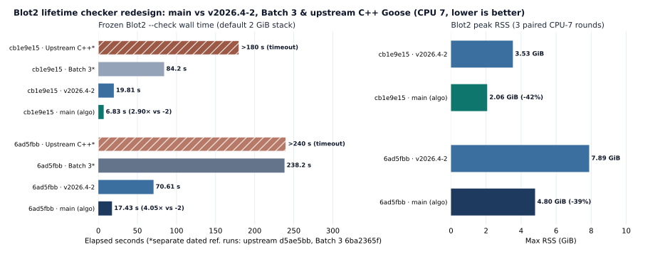
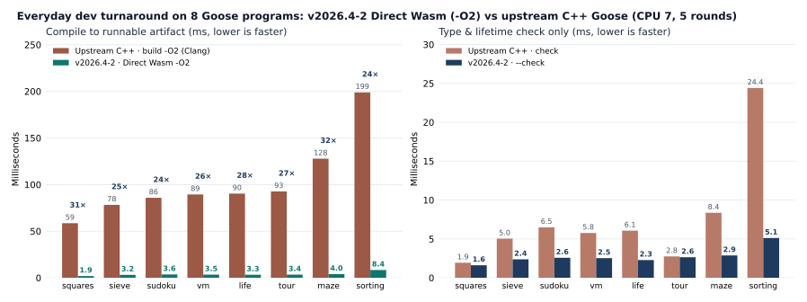

# Goose to Wasm

**A fast, self-hosted [Goose](https://github.com/aardappel/goose) compiler built for rapid edit-compile-run development.**

Goose to Wasm compiles Goose directly to **WebAssembly** in milliseconds — with no C compiler in your inner loop — and compiles the same code to **native binaries or C libraries** when you are ready to ship.

- **Version:** [`v2026.4-2`](https://github.com/mewhhaha/goose-to-wasm/releases/tag/v2026.4-2) (targets upstream Goose `v2026.4`, revision `2`)
- **Compatibility:** `10,697 / 10,801` conformance rows (`99.0%`) · [Feature & compatibility tracker](docs/FEATURES.md)
- **Turnaround vs upstream C++ Goose:** **10.5× faster** `--check` on a 30k-LOC codebase (`0.39 s` vs `4.08 s`), **8.5×–8.6× faster** `-O2` C and Wasm emission (`0.52–0.53 s` vs `4.47 s`), **24×–32× faster** `-O2` builds to runnable WebAssembly (`1.9–8.4 ms` vs `59–199 ms`), and native `-O2` binaries matching upstream C++ Goose within ~1–4%.
- **Agent- & human-friendly diagnostics:** Source-line snippets with exact `^~~~` carets, `got` vs `expected` types with `help:` fixes, overload candidate signatures with `file:line`, Damerau-Levenshtein `"did you mean ...?"` suggestions, and lifetime call stacks.

---

## Quick Start

### Option 1: Download a prebuilt release (`v2026.4-2`)

Grab the prebuilt bundle from [Releases](https://github.com/mewhhaha/goose-to-wasm/releases/tag/v2026.4-2):

- **Linux x64 (native compiler + stdlib):** `goose-to-wasm-v2026.4-2-linux-x64.tar.gz`
- **Portable WebAssembly (macOS / Windows / Linux via Node or Wasmtime):** `goose-to-wasm-v2026.4-2-wasm.tar.gz`

```sh
tar -xzf goose-to-wasm-v2026.4-2-linux-x64.tar.gz
export PATH="$PWD/goose-to-wasm-v2026.4-2-linux-x64/bin:$PATH"
goose --version
# goose-to-wasm v2026.4-2 (Goose v2026.4)
```

### Option 2: Build from source

Requires Python 3 and a C compiler (`clang` default, or `gcc`), plus Node or Wasmtime to run `.wasm` output.

```sh
python3 scripts/bootstrap.py --verify
export PATH="$PWD/build/bin:$PATH"
```

### Everyday development workflow

```sh
# 1. Fast type & lifetime check (no codegen)
goose --check examples/sorting.goose

# 2. Instant dev compile to WebAssembly (no C compiler needed, 2–8 ms)
goose examples/squares.goose -O2 -o squares.wasm
node scripts/run_wasm.mjs squares.wasm
# sum=140

# 3. Compile & run as a native executable (via C)
goose examples/squares.goose --target c -O2 --run
# or with parallel C units & cached runtime:
python3 scripts/goose_wasm.py build examples/squares.goose --backend native -O2 -o squares
./squares

# 4. Embed Goose in a C/C++/Rust host (exports + C header, no -rdynamic/-ldl)
goose --emit-runtime goose_runtime.c
goose app.goose --header app.h -O2 -o app.c
```

See the [full CLI & build guide](docs/GUIDE.md) for `--shared`, `--wasm-memory64`, `--reachable-program`, `--stack-reserve`, and optional Wasmtime host & Binaryen compaction (`scripts/goose_wasm.py compact`).

---

## Benchmarks vs Upstream C++ Goose

All measurements below compare qualified **`goose-to-wasm v2026.4-2`** (`93731c80…`) against **`v2026.4-1`** (`139b06db…`) and plain upstream C++ Goose (`d5ae5bb`, `GOOSE_CC=clang`, pre-warmed `GOOSE_HOME` runtime cache) across 5 alternating rounds pinned to CPU 7 (`clang 23.1.5`, `wasmtime 50.0.1`, `node v26.5.0`). [Full methodology, scripts, and raw JSON](bench/results/2026-11-24/release-v2026.4-2/README.md)

### 1. Large-project compile & check speed

On the compiler's own ~30k-LOC codebase (`selfhost/main.goose`), `v2026.4-2` checks in **`0.39 s`** (**10.5× faster** than upstream C++ Goose's `4.08 s`), emits portable `-O2` WebAssembly in **`0.52 s`** (**8.6× faster** than upstream's `4.47 s` C emit), and emits `-O2` C in **`0.53 s`** (**8.5× faster** than upstream, and **−23.6% faster** than `v2026.4-1`'s `0.69 s` thanks to a **2.2× faster** C backend). Running **as portable WebAssembly** inside Wasmtime, it checks in `1.01 s` (**4.1× faster**) and self-compiles in `1.35 s` (**3.3× faster**).

On `main` (post-`v2026.4-2`), a 7-round algorithmic redesign of the class-keyed lifetime checker further cuts `selfhost/main.goose --check` to **`0.30 s`** (**1.15× faster** than `v2026.4-2`'s `0.34 s` paired on CPU 7) and Wasm64 `-O2` emission to **`0.50 s`** (**1.11× faster**), while slashing the much larger frozen Blot2 compiler checks inside the default 2 GiB stack reserve to **`6.83 s` / `2.06 GiB` RSS** on `cb1e9e15` (**2.90× faster** and **−41.5% RSS** vs `v2026.4-2`'s `19.81 s` / `3.53 GiB`) and **`17.43 s` / `4.80 GiB` RSS** on `6ad5fbb` (**4.05× faster** and **−39.2% RSS** vs `v2026.4-2`'s `70.61 s` / `7.89 GiB`), where plain upstream C++ Goose timed out past `180 s` (`--header`) and `240 s` (`check`) in separate dated reference runs. [Blot2 lifetime checker redesign report & raw JSON](bench/results/2026-11-25/blot2-lifetime-algo/README.md)




### 2. Everyday edit-compile turnaround (8 real programs)

Because Direct Wasm skips the C compiler and linker completely, compiling real Goose programs (`squares`, `sieve`, `sudoku`, `vm`, `life`, `tour`, `maze`, `sorting`) to optimized `-O2` runnable WebAssembly takes **`1.9–8.4 ms`** — **24×–32× faster** than upstream `goose build -O2` (`59–199 ms`). Type and lifetime checking alone takes **`1.6–5.1 ms`** vs `1.9–24.4 ms` upstream (up to **4.8× faster** on `sorting`).



### 3. Runtime performance of compiled programs

Fast compilation does not trade away production speed. Native `-O2` executables emitted by `v2026.4-2` match upstream C++ Goose closely (`sieve` `2.16 ms` vs `2.13 ms`, `mandelbrot` `2.62 s` vs `2.59 s`, `sorting` `37.5 ms` vs `35.7 ms`, all bit-exact). Direct Wasm modules run near-native in Wasmtime (`47.1 ms` on `sorting`, **`2.01 s`** on `mandelbrot`).


---

## Foreign C Functions as Wasm Host Imports

Yes — Goose `extern fn` declarations (both plain `extern fn` and `extern "lib" { ... }`) lower directly to standard WebAssembly host imports in module **`"env"`** (`(import "env" "<name>" (func ...))`):

```goose
// demo.goose
extern fn host_add(a: i64, b: i64) -> i64;
extern "libdemo" { fn host_mul(a: i64, b: i64) -> i64; }

export fn compute(x: i64) -> i64 { return host_mul(host_add(x, 7), 3); }
fn main() {}
```

Compile with `goose demo.goose -O2 -o demo.wasm` and supply `env.<name>` from any Wasm host (Node/browser JS, Wasmtime, `wtime`, or a custom embedder):

```js
const noop = () => {};
const { instance } = await WebAssembly.instantiate(wasmBytes, {
  goose: new Proxy({}, { get: () => noop }), // or wire goose.write / goose.abort
  env: {
    host_add: (a, b) => a + b,
    host_mul: (a, b) => a * b,
  },
});
console.log(instance.exports.compute(5n)); // 36n
```

- **Supported Wasm host-import ABI:** numeric types (`i8`–`i64`, `u8`–`u64`, `f32`, `f64`), `bool`, slices (`T[:]`, passed as packed `i64` in wasm32 or `(i64, i64)` in memory64), and references (`T&` / `const T&`, passed as linear-memory offsets, including growable `u8[>..]&` buffers via the exported `goose.reserve`). Returns accept numeric types, `bool`, or `void`.
- **When passing aggregates:** pass `const T&`, `T[:]`, or an out-reference `T&` across Wasm host imports (or compile with `--target native` for full native C ABI linking). If an `extern fn` signature falls outside the Wasm ABI, the compiler tells you the exact parameter/return type and suggested rewrite.

---

## Exquisite Diagnostics

Compiler diagnostics are designed so both humans and coding agents can diagnose and fix errors in a single turn:

```text
app.goose:3:19: error: no overload matches this call's argument types and count: `add(i64, const u8[:])`
   3 | fn main() { print(add(1, "oops")); }
     |                   ^~~
  note: candidate `fn add(a: f64, b: f64) -> f64` at app.goose:2:4 (argument 2 `b`: got `const u8[:]`, expected `f64`)
  note: candidate `fn add(a: i64, b: i64) -> i64` at app.goose:1:4 (argument 2 `b`: got `const u8[:]`, expected `i64`)
```

Lifetime errors include the offending source span, the invalidated variable and declaration location, actionable `help:` guidance, and the active call stack back to the entry point.

---

## Choosing a Target

| | Direct Wasm (`--target wasm-direct`, default) | Native C (`--target c` / `--backend native`) |
|---|---|---|
| **Best for** | Instant edit-run dev loops, browser/sandboxed tools, custom Wasm host embedders | Maximum runtime speed, CLI tools, servers, C-host libraries |
| **Build time (examples)** | **2–8 ms** (zero C toolchain required) | `140–450 ms` (cached runtime + Clang/GCC) |
| **Build time (30k LOC)** | **0.52 s** | **`0.53 s`** C emit + parallel C compile |
| **Runtime speed** | Near-native in Wasmtime / `wtime-aot`; runs anywhere with Node or a browser | Matches upstream C++ Goose `-O2` within ~1–4% |
| **Features** | Full core language, root structs, `defer`, `const if`, `env.*` host imports, memory32 & memory64 | Everything in Direct Wasm plus threads, `slice_pool`, `--header`, `--shared` |

---

## Compatibility & Versioning

Releases are versioned as **`v<goose-version>-<n>`** (currently **`v2026.4-2`**) so you can see which upstream Goose release is tracked while we ship incremental compiler, diagnostic, and performance updates (`-1`, `-2`, `-3`, ...).

- **Reference:** Plain upstream C++ Goose (`aardappel/goose`) is the language reference.
- **What works:** Core Goose language, generics, root structs, `defer`, `const if`, lifetime checking, stdlib (`std`, `os`, `json`, `math`, `binary`, `base64`, `vec`, `mat`, `quat`, `ascii`, `slice_pool` native, threads native), Wasm `env.*` host imports, and the C-host `--header` / `--shared` / `--emit-runtime` interface (used end-to-end to build the Blot2 compiler).
- **Known differences:** `104` recorded gaps on the `10,801`-row conformance suite (mostly native GUI/audio/physics packages, `format`/`lsp` CLI subcommands, and a small number of edge cases) plus intentional rejections of two upstream false-accept lifetime bugs. See [docs/FEATURES.md](docs/FEATURES.md) for the complete table.

## Documentation

- [Guide & CLI options](docs/GUIDE.md) — building, running, compacting Wasm, optional Wasmtime host
- [Compatibility tracker](docs/FEATURES.md) — feature-by-feature status vs upstream Goose & Blot2 compatibility
- [Self-hosted compiler & bootstrap](selfhost/README.md) — architecture and fixed-point verification
- [Conformance & qualification](tests/README.md) — how changes are tested and qualified
- [Examples](examples/README.md) — runnable Goose sample programs

<details><summary>Historical benchmark archive</summary>

All dated compiler, runtime, Wasmtime, `wtime-aot`, native C codegen, and Blot2 studies live under [`bench/results/`](bench/results/):

- [Blot2 lifetime checker algorithmic redesign — 2.90× `cb1e9e15` (`6.83 s`), 4.05× `6ad5fbb` (`17.43 s`), −40% RSS (2026-11-25)](bench/results/2026-11-25/blot2-lifetime-algo/README.md)
- [Release `v2026.4-2` head-to-head vs `v2026.4-1` & upstream C++ Goose (2026-11-24)](bench/results/2026-11-24/release-v2026.4-2/README.md)
- [Release `v2026.4-1` head-to-head vs upstream C++ Goose (2026-11-24)](bench/results/2026-11-24/release-v2026.4-1/README.md)
- [Blot2 class-keyed lifetime checker speedups — 3.6× `cb1e9e15`, 2.7× `6ad5fbb` (2026-11-24)](bench/results/2026-11-24/blot2-lifetime-speed/README.md)
- [Blot2 `l.alts` compaction & default-2 GiB `6ad5fbb` native build (2026-11-24)](bench/results/2026-11-24/blot2-alts-compaction-and-6ad5fbb/README.md)
- [C-host library interface & native Blot2 `cb1e9e15` build (2026-11-24)](bench/results/2026-11-24/blot2-chost-and-native-build/README.md)
- [Wasm compaction, dead mark elimination & `wtime-aot` safe Rust evaluation (2026-11-23)](bench/results/2026-11-23/wasm-peephole-wtime-aot-and-refresh/README.md)
- [Native C codegen gap closed vs upstream C++ Goose (2026-11-23)](bench/results/2026-11-23/native-c-codegen-gap/README.md)

</details>
